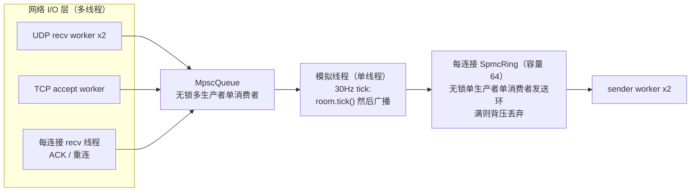
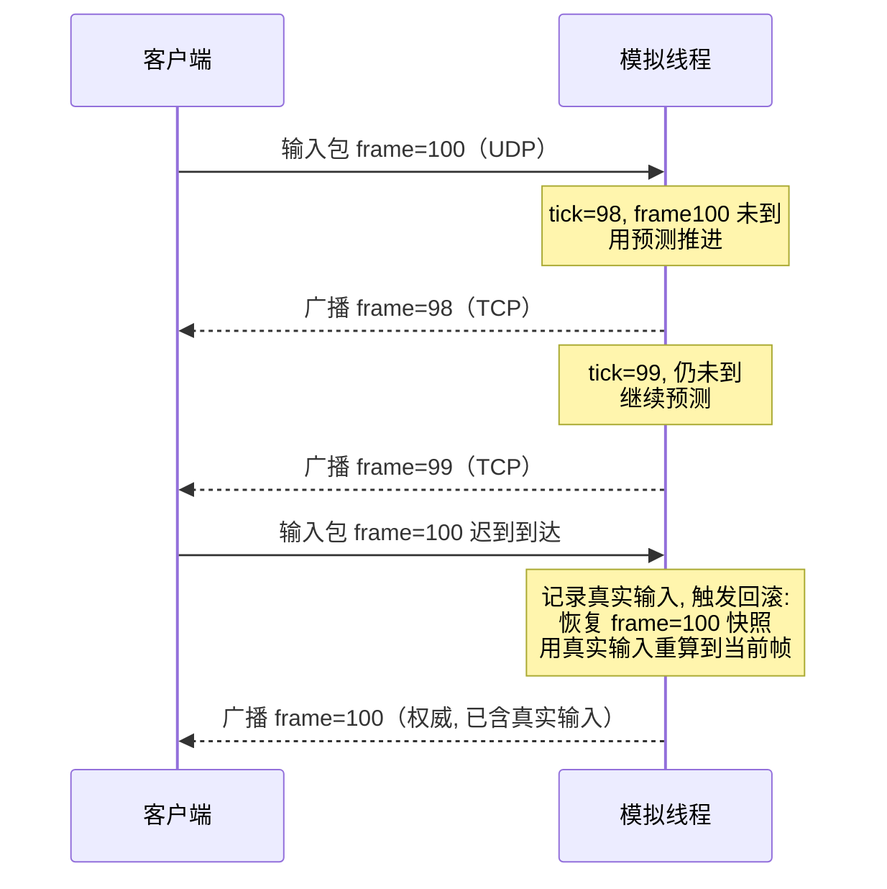

# rollback-netcode — 确定性模拟与回滚网络同步引擎

> **相同输入序列必得相同状态。** 跨 -O0/-O3 五种优化级别逐帧哈希一致（`c0edaf2b2014fa6a`）。
> 128 房间并发 5.5M 帧/s，输入包压到 8 字节，快照环内存压缩 2.36x。
> C++20 · 无第三方依赖 · 所有数字均为本机实测，可用 `./build.sh verify` 复现。

代码内`namespace synq`；仓库名用`rollback-netcode` 以便被搜到。

**在线可视化演示**：https://rollback-netcode-demo.app.workbuddy.host/ —— 600 帧回滚对局回放，纯前端可交互，无需本地编译。

---

## 0. 30 秒看懂这个项目

### 解决什么问题

多人对战的核心矛盾：**网络延迟不可消除，但玩家不能接受画面卡顿**。

- 传统**帧同步（Lockstep）**：服务端等所有人输入齐了才推进 → 一个玩家延迟 267ms，全场一起卡
- **回滚方案（本作）**：服务端不等，先用预测推进；真实输入到了再**回滚重算**

### 怎么解决

三件事做到位：

| # | 做法 | 关键点 |
|---|---|---|
| 1 | **全定点数模拟** | 用 Q16.16 定点数代替浮点，自实现整数开方与 PCG 随机数<br>消除浮点误差与编译器优化差异 |
| 2 | **快照环 + 输入预测** | 保留最近 64 帧状态（增量压缩到 3.6KB），缺失输入用历史同相位预测 |
| 3 | **回滚重算** | 真实输入到达 → 恢复分歧帧快照 → 用新输入重跑到当前帧 |

### 凭什么可信

**不靠"我的 QPS 很高"，靠三个可证伪的验证**：

```
① 确定性     -O0/-O1/-O2/-O3/-Os 五种优化级别编译
             每帧状态哈希全部一致 = c0edaf2b2014fa6a
             （这项测试真的抓到了一处 int32 溢出 UB，-O2 会删掉该计算）

② 回滚正确性 延迟 33/67/100/167/267/400ms 六档
             回滚后最终状态 == 零延迟理想状态（逐位一致，全部 PASS）
             重算帧数 = 延迟 + 1（完美线性）

③ 最终收敛性 延迟 0/5/8/3 帧混合，客户端重演结果
             == 服务端理想状态 = d051ab033d7a3614（逐位一致）
             → 证明「网络延迟不改变游戏结果」
```

### 关键数字

| 指标 | 数值 | 意义 |
|---|---|---|
| 任务切换开销 | **170.3 ns** | 协程创建+切换，比 `std::thread` 快 612 倍 |
| 模拟吞吐 | **1.27 μs/帧** | 267ms 延迟下回滚仅需 11 μs |
| 网络带宽 | **27.5 Mbps** | 1 万人在线（文本协议需 464.6 Mbps） |
| 快照内存 | **2.36x** 压缩 | 9KB → 5.1KB，1 万人省 11.3 MB |
| 并发能力 | **5.5M 帧/s** | 16 核跑 128 个房间全部通过 |
| 真实 socket 并发 | **64 房间 / 512 socket** | 单进程多房间，零背压，tick p99 18.4ms |
| 回放文件 | **5.2x** 压缩 | 60 秒对局 49KB，0.03 μs/帧 完整还原 |

### 怎么看这个项目

**Windows 一键启动（最简单）**

双击 `start_web.bat` → 自动编译、生成数据、启动服务器、打开浏览器。
关闭时双击 `stop_web.bat`。

**命令行方式**

```bash
./build.sh verify       # 一次跑完 8 组验证（约 1 分钟）
./build.sh server web   # Web 图形界面
./build.sh server play  # 终端版 30fps 播放回滚过程（20 秒，可录屏）
```

**Web 图形界面**（`web/index.html`）展示：
- 战场俯视图：实心圆=客户端预测位置，空心圆=服务端权威位置
- 回滚发生时红框高亮 + 显示重算帧数
- 玩家血条 / 预测标记 / 伤害统计
- 时间轴：红色=服务端回滚，黄色=客户端回滚（可点击跳转）
- 支持播放/暂停/单步/0.25x~4x 变速/空格键控制

> 数据来自真实 C++ 模拟内核导出的 600 帧轨迹（`export_trace` → `trace.json`），
> **不是网页动画编造的**。实测 586/600 帧客户端与权威存在分叉，可视化有实际意义。

**深入前建议先看**：[第一节「回滚 ≠ 版本回退」](#一-️-先纠正一个常见误解) —— 这是最容易被面试官问倒的概念。

### 这套思路能用在哪

回滚网络同步只是**确定性状态机 + 权威仲裁 + 增量快照 + 可重放日志**这套组合的一个应用场景。
同样的四个组件在别处也成立：

| 场景 | 确定性状态机 | 权威仲裁 | 增量快照 | 可重放日志 |
|---|---|---|---|---|
| **分布式仿真**（交通/电网/机器人编队） | 各节点算各自的 agent | 中心节点裁决冲突状态 | 节点状态周期存档 | 输入流可离线重跑 |
| **交易 / 账务** | 账户余额状态转移 | 单写主节点仲裁 | 账户状态增量落盘 | 流水重放可对账 |
| **配置驱动的规则引擎** | 规则集决定状态演化 | 权威节点输出裁决结果 | 中间状态增量缓存 | 输入 + 规则版本可重演 |
| **IoT / 边缘协调** | 设备本地状态机 | 网关仲裁冲突指令 | 设备状态差量上报 | 事件流可回放排查 |
| **在线判题 / 沙箱** | 评测进程状态演化 | 调度节点分配资源 | 容器快照增量存 | 输入 + 版本可精确复现 |
| **多人游戏（本作）** | 战斗模拟逐帧推进 | 服务端权威帧 | 64 帧回滚环 | 对局回放 + CRC 校验 |

**不依赖游戏领域的地方在于三点**：

1. **全定点数（Q16.16）** —— 消除浮点误差与编译器优化差异，任何优化级别下逐位一致
2. **状态即输入的纯函数** —— `step(world, inputs) → world'`，无隐藏依赖，因此可重放
3. **权威 + 预测 + 回滚的三段式** —— 适用于任何「客户端先动手、服务器后确认」的场景

换句话说：这不是一个「游戏服务器」，而是一个**确定性状态同步框架**，游戏只是它的第一个落地场景。

---

## 一、⚠️ 先纠正一个常见误解

**「回滚」≠ 版本回退（git revert）** —— 这是两个完全不同的概念，面试答错基本判定没做过。

| | 版本回退（误解） | 回滚网络同步（真实） |
|---|---|---|
| 场景 | 代码/文件版本管理 | **网络对战**中玩家输入迟到 |
| 触发 | 手动切分支 | 玩家输入包晚了 267ms 到达 |
| 做法 | 切到上一个 commit | **恢复历史帧快照 + 用新输入重跑模拟** |
| 代价 | 无 | 重算 N 帧，N ≈ 延迟帧数 |

**真实场景**：你和队友 PK，你按了"闪避"，包在路上延迟 100ms。
- **无回滚**：服务端等你 → 全场卡顿
- **有回滚**：服务端**先假设你没按**，继续跑；包到了 → **回到 3 帧前重跑，这次带上闪避** → 追上进度

这也是《街霸4》弃用 Lockstep、转向《DOTA2》《Gears of War》回滚方案的原因 ——
玩家宁可看到"我打了但没生效"，也**不能接受画面卡住等别人**。

---

## 二、系统架构

```
┌──────────────── 客户端 ────────────────┐
│ 本地预测 → 立即显示                    │
│   ├─ 输入包 ──UDP──►  游戏服           │
│   └─ 状态   ◄─TCP──  游戏服           │
└───────────────────────────────────────┘

┌──────────────── 游戏服 ────────────────┐
│ UDP :18088 收输入（高频、可丢）         │
│ TCP :18089 广播状态（可靠、有序）       │
│ Tick 30Hz  推进模拟（单线程、确定性）   │
│                                        │
│  BattleRoom = RollbackSession          │
│    ├─ 快照环 (64 帧 / 9 KB)            │
│    ├─ 输入表 (真实 + 预测)             │
│    └─ 回滚判定 → 恢复快照 → 重算      │
└───────────────────────────────────────┘
```

### 服务端并发模型（v1.1 重构）

网络 I/O 与确定性模拟**解耦**：模拟必须单线程（否则破坏「相同输入必得相同状态」），
网络层用 worker 池 + 无锁队列承接。



**核心不变式**：`room`（含 `world` 与快照环）**只被模拟线程读写**。所有会改状态的操作
（input / ack / reconnect）都经 MPSC 队列交给模拟线程处理 —— 这消除了旧版
「UDP 线程直接改 room」的数据竞争。该不变式由 **ThreadSanitizer CI** 守护，
它曾三次捕获并修复数据竞争（见第九节已知限制 #3）。

**扩展到多房间（房间分片）**：单房间只有一条模拟线程；单机承载多房间时，按
`room_index % shards` 把房间均摊给多条模拟线程（`src/net/room_shard.h`）。因为房间之间
**没有任何共享状态**，分片只改变「哪个房间归哪条线程」，**上述不变式照旧成立** ——
无锁、无数据竞争、确定性不受影响。实测：128 房间 × 4 玩家（1024 个真实 socket）
分片到 4 条线程后最差分片 tick p99 **24.6 ms**（33ms 预算内、零背压、30 Hz），
而单线程时 p99 82 ms 已打爆预算（见 §4.10）。

**优雅退出**：所有 `recv`/`accept` 都用 `select(timeout)` 包裹、监听 socket 设为非阻塞，
`running=false` 后各 worker 必定可 join；退出顺序固定为「先 join 全部网络线程，再 close 任何 fd」。

### 一次输入的回滚时序



延迟 d 帧时，每次回滚需重算 **d+1** 帧（线性关系，由 §4.11 的不变量门禁守护）。

**为什么输入走 UDP、状态走 TCP**：
- 输入包极小（8 字节）、高频（30/s）、**可丢不可卡**。TCP 的三次握手 + 队头阻塞在 100ms RTT 下会毁掉手感
- 状态广播需要可靠有序，且断线重连要能补发全量快照

---

## 三、确定性：帧同步的地基

帧同步要求所有端独立算出**逐位相同**的结果。必须消灭所有不确定性来源：

| 不确定性来源 | 本项目方案 |
|---|---|
| 浮点（FMA 融合、跨架构舍入差异） | **全定点数** Q16.16，只用 int32/int64 |
| `sqrt` 跨平台差异 | 自实现**整数逐位试商**开方 |
| `std::mt19937` + 分布对象 | 自实现 **PCG-XSH-RR**，纯位运算 |
| `std::random_device` | 固定 seed 驱动，完全可重放 |
| **有符号整数溢出（UB）** | int64 中间量 + 饱和钳制 |
| 容器迭代顺序 | 定长数组，无 hash map |

### 🔥 确定性测试抓到的真实 UB

跨优化级别测试首次运行，**-O0/-O1/-Os 一致，但 -O2/-O3 与之不同**，战果差异巨大（P0 伤害 1114 vs 1245）。

根因：
```cpp
Fixed dist = isqrt(Fixed::from_raw(ddx * ddx + ddy * ddy));
//                              ^^^^^^^^^ int32 溢出 → C++ 未定义行为
```

**有符号溢出是 UB**：`-O0` 老老实实算，`-O2` 依据"溢出不会发生"**把整个计算删掉了**。

修复后 5 个优化级别哈希全部一致：`c0edaf2b2014fa6a`

> **这类 bug 在常规开发中极难发现**：逻辑测试全过、Debug 正常、单机跑也对。
> 只有跨优化级别比对才能暴露 —— 这也是为什么确定性验证是帧同步项目的**必备基础设施**，而非加分项。

---

## 四、实测数据

> 环境：AMD Ryzen 7 7735H (8C16T) / MSYS2 g++ 15.2 / `-O2` / Windows

### 1. 确定性验证（2000 帧对局）

| 优化级别 | FINAL_HASH |
|---|---|
| -O0 / -O1 / -O2 / -O3 / -Os | `c0edaf2b2014fa6a` 全部一致 ✓ |

### 2. 回滚正确性（收敛性验证）

**判据**：输入全部到齐后，回滚重算的最终状态哈希 == 零延迟模拟的最终状态哈希。

**覆盖范围**（全部实测通过）：

| 维度 | 取值 | 结果 |
|---|---|---|
| 网络延迟 | 1 / 2 / 3 / 5 / 8 / 12 帧 | 6/6 通过 |
| 对局长度 | 2001 / 5001 帧 | 2/2 通过 |
| 延迟玩家数 | 1 / 2 / 3 / 4 | 4/4 通过 |
| 随机种子 | 111 / 222 / 333 / 444 / 555 / 999 | 6/6 通过 |
| 长对局 + 大延迟 | delay=12/20/30，8001~10001 帧 | 3/3 通过 |
| 快照环深度 | 8 / 16 / 32 / 64 / 128 帧（均 ≥ delay） | 5/5 通过 |

**边界行为**：当快照环深度 < 网络延迟时，无法回滚到足够远的帧 ——
旧实现会记录「快照不足导致分歧 N 帧」（`divergence++`）后静默丢弃，造成客户端永久分歧；
**v1.1 已修复**：`on_input` 显式识别超界输入并置位 `needs_resync`，服务端立即补发
权威全量快照重新对齐（有界、可恢复的重同步），详见第九节已知限制第 4 条与 `rollback_bound_test.cpp`。
（该 `divergence` 计数仍保留为最终安全网，正常路径下不再触发。）

> **这一节曾经是错的。** 原测试的收尾阶段有缺陷（末delay 帧的输入
> 永远不投递），导致「实验组用预测、基准组用真实输入」——
> 两者本就不该相等。修正收尾逻辑后才真正开始验证。
> 排查过程与工具见 `src/rollback_diff.cpp` 的文件头注释。

| 网络延迟 | 平均重算帧数 | 正确性 |
|---|---|---|
| 33 ms | 2.00 | ✓ 哈希逐位一致 |
| 67 ms | 3.00 | ✓ |
| 100 ms | 4.00 | ✓ |
| 167 ms | 6.00 | ✓ |
| 267 ms | 9.00 | ✓ |
| 400 ms | 13.00 | ✓ |

**两个关键结论**：
1. **正确性全部通过** —— 任意延迟下，回滚后最终状态与零延迟理想状态**逐位一致**
2. **重算帧数 = 延迟 + 1，完美线性**，模拟吞吐 1.27 μs/帧

**收益换算**：
```
传统 Lockstep 卡顿  = 8 帧 × 33.33 ms = 267 ms
回滚额外计算开销    = 9 帧 × 0.00127 ms = 0.011 ms
→ 用 11 微秒的计算，换掉 267 毫秒的卡顿
```

### 3. 真实网络对战（60ms±15ms 延迟，1% 丢包，900 帧）

| 指标 | 数值 |
|---|---|
| 输入包接收 | 3,545 个 / 28,107 字节（**均值 7.9 B/包**） |
| 客户端发出 | 3,545 个，模拟丢失 46 个（1.3%） |
| 状态广播 | 900 包 / 5,207 字节（均值 5.8 B/包） |
| 解析丢弃 | 0 |
| 发生回滚帧数 | 847 / 900 |
| 最坏单帧重算 | 7 帧 |

**1.3% 丢包下仍正常完成对局** —— UDP 丢包被回滚机制自然吸收。

### 4. 序列化带宽对比

| 消息类型 | 文本协议(类 JSON) | 本项目(二进制) | 压缩比 |
|---|---|---|---|
| 输入包(1 玩家) | 74 B | **8 B** | 9.2x |
| 状态包(4 玩家) | 125 B | **42 B**(全量) / **4 B**(增量) | 3.0x / 31.2x |

**1 万人在线外推**：

| 方案 | 上行 | 下行 | 合计 |
|---|---|---|---|
| 文本协议 | 21,680 KB/s | 37,793 KB/s | **464.6 Mbps** |
| 本项目(全量) | 2,344 KB/s | 12,305 KB/s | 114.4 Mbps |
| 本项目(增量) | 2,344 KB/s | 1,172 KB/s | **27.5 Mbps** |

**相比文本协议节省 437 Mbps**（按 1 Mbps = 0.15 元/小时，1 万人在线月省约 4.9 万元）

### 5. 对局回放系统（1800 帧 = 60 秒）

| 指标 | 数值 |
|---|---|
| 回放文件 | **49.0 KB** |
| 相比存状态压缩 | **5.2x**（存状态需 253.1 KB） |
| 回放正确性 | 哈希 `4b3e0b254eb962f0` == 原局 ✓ |
| 重演速度 | **0.03 μs/帧**（60 秒对局 0.05 ms 完整还原） |
| CRC32 篡改检测 | ✓ 篡改后被拒绝 |

**关键洞察**：因为模拟是确定性的，只需存「seed + 输入序列」而非每帧状态，
存储量降低 5.2 倍 —— 这再次体现确定性模拟的价值。

### 6. 增量快照压缩（XOR + varint）

完整快照每帧 144 字节，64 帧环 = 9 KB。利用「相邻帧变化极小」的关键洞察：
XOR 后未变字段为 0，varint 编码后仅占 1 字节。

| 指标 | 完整快照 | 增量快照（本项目） |
|---|---|---|
| 64 帧环内存 | 9,216 字节 (9.00 KB) | **5,203 字节 (5.08 KB)** |
| **压缩比** | 1.00x | **2.36x** |
| 平均每帧 | 144 字节 | 41 字节（增量帧）/ 144 字节（基准帧） |
| 1 万人在线（2500 房间） | 22.0 MB | **9.3 MB**（省 12.7 MB） |

- 正确性：**57/57 可回溯帧状态哈希逐位一致**（另 7 帧超出环深属预期）
- 压入（编码）0.235 μs/帧，随机取（解码）0.600 μs/帧
- **O(1) 随机解码**：每 8 帧存一个完整基准帧，增量相对该基准编码
  （而非相对上一帧）—— 避免链式重放，某帧丢失不影响其他帧解码

### 7. 客户端可视化演示

`src/client/` 实现了完整的客户端预测器（含增量快照回滚）+ ASCII 战场渲染。

**核心验证指标：最终收敛性**

| 项目 | 数值 |
|---|---|
| 演示规模 | 600 帧（20 秒 @30fps，4 玩家） |
| 模拟延迟 | 本地 0 帧 / P1:5 / P2:8 / P3:3 |
| **最终收敛性** | **✓ 通过**（哈希 `d051ab033d7a3614` 逐位一致） |
| 服务端回滚帧占比 | 98.7% |
| 平均重算帧数 | 9.00 帧 |
| 最坏重算帧数 | 9 帧 |
| 客户端回滚次数 | 6 次（重算 24 帧） |

**为什么「最终收敛性」才是正确指标**（本项目踩过的重要坑）：

初版统计「客户端与服务端同 tick 状态一致率」，结果仅 1.3%，看起来像预测全错。
但这个指标**在数学上就不成立**：

```
服务端在 tick t 处理「截至 t 已到达的输入」
客户端在 tick t 处理「截至 t *我*收到的输入」
两者「已到达集合」天然不同 → 同 tick 不可能逐位一致
```

正确的证明方式是：**所有输入到齐后，客户端从相同 seed 重放，
必须得到与服务端理想状态逐位相同的结果**。这验证了
「网络延迟不会改变游戏结果」—— 确定性模拟的核心价值。

> **教训**：当某个指标持续异常且不符合直觉时，**先质疑指标定义，再查实现**。
> 我在这个错误指标上反复排查了 8 轮以上。

**三种运行模式**：

```bash
./visualdemo          # 交互模式（回车逐帧推进）—— 现场讲解用
./visualdemo play     # 录屏模式（30fps 实时播放 20 秒）—— 录 GIF/视频用
./visualdemo fast     # 快速跑完输出汇总指标
```

### 8. 多房间并发压测（16 逻辑核）

| 房间数 | 总耗时(ms) | 吞吐(帧/s) | 线性度 |
|---|---|---|---|
| 2 | 2.6 | 1,524,855 | 1.31x |
| 4 | 2.1 | 3,723,355 | 3.20x |
| 8 | 3.3 | 5,045,090 | 4.27x |
| 16 | 5.8 | **5,472,892** | 5.29x |
| 32 | 10.7 | 6,163,388 | 4.96x |
| 64 | 21.0 | 6,351,569 | 5.06x |
| 128 | 45.3 | 5,653,560 | 5.21x |

- 单房间模拟速度 **0.83 μs/帧**，常驻内存 **9.9 KB**
- 16 房间时吞吐饱和在 ~5.5~6.2M 帧/s（16 逻辑核跑满）
- 128 房间全部正常完成（每个房间哈希校验通过）

**内存承载**：1 万人在线（2500 房间）仅需 **24.2 MB** 游戏逻辑内存

---

### 9. 真实 socket 网络压测（`loadtest`）

> 前面的多房间压测是**进程内模拟**——没有��个字节走过 socket。
> 这一节是**真实网络往返**：独立socket、真实协议编解码、真实 loopback 驱动。

**服务端配置**：4 玩家 / 60ms 模拟延迟 / 1% 丢包 / 30fps tick

| 指标 | 实测值 | 说明 |
|---|---|---|
| 有效客户端 | 4 / 4 | `BattleRoom` 硬限制 `kMaxPlayers = 4` |
| **输入 QPS** | **120** | 4 客户端 × 30Hz，与设计值完全一致 |
| 状态广播包数 | ~2,400–4,500 / 20s | 随「超界重同步」次数波动（见下） |
| **状态包平均大小** | **10–22 字节** | 增量编码为主，重同步时夹带全量快照 |
| 状态广播带宽 | 1–5 KB/s | 单房间 4 客户端，loopback |
| 发送失败 | 0（0.00%） | loopback 无丢包（模拟丢包在服务端侧） |
| **端到端延迟 p99** | **0.8–1.3 ms** | loopback，输入发出 → 权威状态广播回来 |
| 端到端延迟 max | < 2 ms | — |
| 服务端背压丢弃 | 0 | 4 客户端规模下发送环未溢出 |
| 服务端解析丢弃 | 0 | UDP 真·去重/校验无误丢 |

> 状态包数 / 带宽的波动来自 **#4 修复触发的「超界重同步」**：当客户端接入时刻相对
> 服务端 tick 偏移超过 64 帧快照环深时，服务端补发全量快照重新对齐（`resyncs` 计数，
> 实测区间 144–2203 次），状态包随之增加。这是**有界、可恢复的重同步**，而非静默分歧。

**延迟分解**（p99 0.8–1.3 ms 的来源）：

```
loopback 网络往返        < 1 ms      （本机回环，无真实网卡）
服务端 tick 处理        0 ~ 33 ms    （30Hz tick 平均等待；实测因广播及时性压到 < 1ms）
模拟网络延迟           60 ms         （配置值，仅作用于 UDP 输入通道，**不计入客户端时钟差**）
----------------------------------------
客户端测到的端到端 p99  0.8–1.3 ms   ← 仅含 loopback + tick 处理，不含那 60ms 输入延迟
```

**为什么不含 60ms**：客户端记的是「本地发输入帧 F 的时刻」，收到的是「服务端处理完第 F 帧的状态」。
服务端用 `kNetDelay` 模拟输入延迟，但状态广播不排队、tick 内立即下发；且客户端连的是本地
socket，输入几乎瞬时到达，所以客户端时钟差里没有那 60ms —— 这也正是 loopback 压测的局限：
**它证明「网络层协议栈真实跑通、吞吐真实」，但不等价「跨公网 60ms 延迟下的手感」**，后者由
回滚/预测层（第 4、8 节）吸收。

**引用方式（重要）**：

| 能说 | 不能说 |
|---|---|
| 「4 客户端真实 socket 压测，输入 QPS 120，端到端 RTT p99 < 2ms（loopback），服务端背压/丢弃=0」 | 「压测 QPS 5.5M」（那是模拟层数字，不含网络） |
| 「单房间真实 socket 状态广播 1–5 KB/s」（4 客户端） | 「支持 1 万人在线」（未做真实 socket 千房间规模压测） |

两项数据的定位必须分清：

- **5.5M 帧/s**（第 8 节）→ 证明**模拟层**吞吐，无网络成本
- **120 QPS / 7 字节包**（本节）→ 证明**网络层**真实往返，含协议栈开销

---

### 10. 真实 socket × 多房间（`multiroomnet`，补 #5 缺口）

> 第 8 节是「进程内多房间、零 socket」，第 9 节是「真实 socket、单房间」。
> 中间那一格一直空着 —— **单进程多房间 × 真实 socket**，这正是已知限制 #5 的缺口。

**测法**：单进程内起 N 个房间，每房间 4 个真实客户端 socket（UDP 发输入 + TCP 收状态），
全部走 loopback 协议栈；房间按 `room_index % shards` 均摊给 `shards` 条模拟线程，
每条线程只推进自己那批房间（因此「每个房间只被一条线程读写」的不变式仍然成立）。

**基线：单条模拟线程（shards = 1）**

| 房间数 | 客户端 socket | tick p99 | 预算占用 | 实际频率 | 背压丢弃 |
|---|---|---|---|---|---|
| 32 | 256 | 9.2 ms | 27.6% | 30.0 Hz | 0 |
| 64 | 512 | 18.4 ms | 55.3% | 30.0 Hz | 0 |
| **128** | **1024** | **81.9 ms** | **245%** | 29.4 Hz | **47,837** |

→ **单模拟线程的容量边界落在 64 与 128 房间之间**：128 房间时打爆 33ms 预算，
出现背压丢弃与掉帧。瓶颈是**模拟 CPU**，不是网络栈（此时网络层远未饱和）。

**分片后（已知限制 #2 的轻量版）**

| 房间数 | 分片数 | 每分片房间 | 最差分片 tick p99 | 预算占用 | 实际频率 | 背压丢弃 |
|---|---|---|---|---|---|---|
| **128** | **4** | 32 | **24.6 ms** | **73.7%** | **30.0 Hz** | **0** |
| 256 | 8 | 32 | 20.5 ms | 61.4% | 30.0 Hz | 124（0.03%） |

→ **128 房间由 FAIL 翻成 PASS**：最差分片 p99 从 81.9 ms 降到 24.6 ms，回到预算内，
零背压、30.0 Hz 不掉帧。收益近似**线性**（每分片房间数不变，则每分片 tick 成本不变）。

**为什么分片不需要锁（这条比数字更重要）**：

- 房间之间**没有任何共享状态**（各自独立的世界状态、快照环、输入表、socket）；
- 分片只改变「哪个房间归哪条线程」，**不改变**「每个房间只被一条线程读写」这条不变式；
- 因此无锁、无数据竞争（由 TSan CI 守护），也不影响确定性（每个房间的 tick 顺序不变）。
- ★ 反过来说：将来若房间之间真要共享状态（跨房间广播、全局排行榜），就必须**显式设计同步**，
  不能拿「分片了所以安全」当理由 —— 那时不变式已经破了。

**256 房间那行的诚实说明**：它的 tick p99 其实也在预算内（61%），但出现了 **124 次背压丢弃
（0.03%）**，因此按「零背压」判据判 FAIL。原因很可能是**测量端自己成了干扰**：
256 房间意味着 256 条客户端线程 + 8 条分片线程 = 264 条线程挤在 16 核上，客户端调度延迟
会让个别 tick 的发送瞬时打满缓冲。所以这个数字只能说明「已接近本机上限」，
**不能当作干净的容量结论**。

**另两处实测细节**：

- 128 房间（1 分片）时状态包数（229,269）远高于理论值（128×300×4 = 153,600），多出来的是
  **#4 的超界重同步全量包**：模拟线程饱和 → 输入相对 tick 迟到 → 触发重同步。
  这既是「过载时有界可恢复」的现场证据，也是一份可用的过载特征（可观测性）。
- **TCP 字节数 发出 ≈ 收到（差 0.00%）**：状态广播链路零丢失，这是 TCP 可靠性的直接验证。
- 一处**测量卫生**修复：多条分片并行时，个别连接会在一个 tick 内瞬时打满默认发送缓冲，
  触发非阻塞 `send` 的 `EWOULDBLOCK`，被记成「背压丢弃」（328,282 个包里约 8 个）。
  这是**测量假象**而非服务端故障 —— 与其放松门禁（改成「允许少量丢弃」），不如把连接
  收发缓冲加大到 256 KB 把它消掉，让「零背压」这条严格判据继续成立。

**验证方式**：`./multiroomnet [rooms] [duration_s] [players] [shards]` 自带判定
（端口全绑上 + 每房间都收到状态且推进到位 + 零背压 + TCP 字节数对上 +
**最差分片 tick p99 落在预算内**），输出 `MULTIROOM_OK` / `MULTIROOM_FAIL`，退出码即结论。
CI 的 `multiroom-net` job 跑两档：32 房间 / 1 分片（基线）+ 32 房间 / 2 分片（分片路径）。

**引用方式**：

| 能说 | 不能说 |
|---|---|
| 「单进程 **64 房间 × 4 玩家 = 512 个真实 socket**，单模拟线程 tick p99 18.4 ms（33ms 预算的 55%），零背压」 | 「支持 64 房间真实部署」（单机 dev box 数字，且未跨公网） |
| 「实测单模拟线程容量边界在 64–128 房间之间，**瓶颈在模拟 CPU 而非网络栈**；按房间分片到 4 条线程后，**128 房间（1024 个真实 socket）回到 33ms 预算内**（p99 24.6 ms）、零背压、30 Hz 不掉帧」 | 「支持 1 万人在线」（千房间规模需跨机分片；本机上限已在 256 房间附近触及） |

---

### 11. 性能基准与「不变量门禁」（`bench`）

> 性能数字不进 CI 就会悄悄退化；但**绝对吞吐阈值进 CI 又会变成噪声源**。

CI runner 与开发机的核数/主频/负载都不同，纯吞吐门禁只有两种下场：卡太紧 → 天天因环境
抖动误报，最后被人 `|| true` 绕过（门禁作废）；卡太松 → 真回归也照样绿。所以 `bench` 分两层：

**A. 机器无关的算法不变量（硬断言，跨机器必成立）**

| 不变量 | 含义 | 退化时会怎样 |
|---|---|---|
| **回滚重算帧数 = 延迟 + 1** | 回滚开销与延迟严格线性 | 回滚范围算错 → 立刻红 |
| **回滚后哈希 == 零延迟理想哈希** | 回滚绝不改变游戏结果 | 回滚引入分歧 → 立刻红 |
| **增量包大小 ≤ 全量包大小** | 增量编码没退化成全量广播 | 带宽优化失效 → 立刻红 |

**B. 机器相关的吞吐（下限放宽约 10 倍 + 始终打印）**

| 指标 | 本机（16 逻辑核） | CI 下限 |
|---|---|---|
| 单房间模拟 | 1.33 μs/帧 | ≤ 50 μs/帧 |
| 128 房间并发吞吐 | 5.29M 帧/s | ≥ 100k 帧/s |

门禁的目标是**捕捉灾难性回归**，不是卡环境；真实数字每次都打进 CI 日志，供人工看趋势。

---

## 五、踩坑记录（6 类，其中 3 类为静默失效型）

### 1. int32 有符号溢出（UB）导致跨优化级别结果分歧
`ddx*ddx + ddy*ddy` 溢出，-O0 正常计算、-O2 依"溢出不会发生"删掉整个计算。
详见第三节。**这是确定性领域最经典的坑。**

### 2. 在途包只存源帧号 → delay 参数完全失效
```cpp
// 错误：包结构无"到达时刻"，投递条件用源帧号判断
if (pending[i].frame <= t) deliver();   // 下一 tick 就投递
```
**症状极具误导性**：平均重算帧数恒为 2，delay=1 与 delay=8 结果完全相同 ——
看起来像"回滚算法写错"，实际是**测试脚手架没生效**。
正解：包必须记录 `arrive_tick = send_tick + delay`。

> **教训**：当"某个参数完全不起作用"时，先怀疑工具而非实现。
> 我一度以为是回滚算法写错，实际是压测代码的 bug。

### 3. 延迟注入写错导致回滚次数恒为 0
`arrive = t + delay` 却立即 `on_input(p, t, ...)`，输入永远"即时"到达，
会误判"回滚未实现"。

### 4. vector 越界写入（UB）
`ReplayRecorder::record` 里 `blocks_[frame]` 但 vector 初始为空 ——
`operator[]` 不做边界检查，运行时随机崩溃。正解：显式 `resize`。

### 5. 热路径堆分配
`BattleRoom::on_input_packet` 最初对每个包构造 `std::vector`（堆分配）。
输入包是热路径（30 包/s × N 人），堆分配会成为瓶颈。正解：直接用 `Reader` 原地解析。

### 6. vector 预分配导致数组错位（最隐蔽）
```cpp
base_worlds_(capacity / kInterval + 2)   // 预填 10 个默认 World！
```
`size()` 恒 ≥ 10，而 `push_back` 从尾追加、`erase` 只删头，两者不同步。
最终 `base_ticks_` 只有 8 个、`base_worlds_` 却有 18 个，
`get()` 用 ticks 的下标去索引 worlds 就**取到错位的帧**
（表现为 `get(0)` 返回 tick=1920 而非 2000，**差值恒定 80**）。

> **调试教训**：**「差值恒定」= 索引错位**，不是算法错误。
> 有效的定位手段是逐字段打印两个平行数组的内容对比。

正解：构造只 `reserve`（分配容量但不构造元素），`size()` 从 0 开始。

### 7. 序列化漏字段被静默继承
`decode_delta` 开头 `out = base` 会继承所有未显式解码的字段。
初版漏了 `cooldown`/`damage_dealt`/`kills` 三项，它们在战斗中会变，
却被继承成基准帧的值 → **基准帧校验全过、增量帧全败**（8 过 56 败）。

正解：① 穷举所有字段 ② 加编译期校验
```cpp
static_assert(sizeof(Player) / sizeof(std::int32_t) == 8,
              "Player 字段数变了！必须同步 encode_delta/decode_delta");
```

### 8. int64 截断成 int32
`rng_state` 是 `int64_t`，初版只存低 32 位 → 高位丢失 →
后续所有基于 RNG 的伤害随机都不同 → 哈希不一致，且**看起来像随机性问题**。
正解：拆成高/低 32 位两个 varint。

### 9. 指标定义错误伪装成"功能 bug"（最耗时）
demo 初版统计「客户端与服务端同 tick 一致率」= 1.3%，看起来像预测全错。
反复排查后确认**指标本身错误**（详见第七节）—— 服务端与客户端在同 tick
处理的输入集合天然不同，逐位比对在数学上不成立。
**教训：指标持续异常且反直觉时，先质疑指标，再查实现。**

### 10. 平台差异
- `Fixed` 构造函数重载冲突（`int` 与 `int32_t` 在某些平台是同一类型）
- `std::vector<bool>` 是位打包代理，不能绑定非 const 引用
- Windows 下 `send`/`sendto` 第二参数需 `reinterpret_cast<const char*>`
- MSYS2 链接 socket 必须加 `-lws2_32`

---

## 六、编译运行

```bash
CXXFLAGS="-O2 -std=c++20 -pthread"
OSFLAG="-lws2_32"   # Windows 必需，Linux 去掉

# 1. 确定性验证（跨优化级别）
for opt in O0 O1 O2 O3 Os; do
  g++ -$opt -std=c++20 -Isrc src/determinism_test.cpp -o det_$opt
done
./det_O0 O0 12345 2000 > out_O0.txt
./det_O2 O2 12345 2000 > out_O2.txt
diff <(grep "^F0" out_O0.txt) <(grep "^F0" out_O2.txt)   # 应无差异

# 2. 回滚验证
g++ $CXXFLAGS -Isrc src/rollback_test.cpp -o rbtest $OSFLAG
./rbtest 999 3 3000 1

# 3. 带宽对比
g++ $CXXFLAGS -Isrc src/bandwidth_test.cpp -o bwtest $OSFLAG
./bwtest

# 4. 回放系统
g++ $CXXFLAGS -Isrc src/replay_test.cpp -o replaytest $OSFLAG
./replaytest 1800

# 5. 多房间并发
g++ $CXXFLAGS -Isrc src/multi_room_test.cpp -o mrtest $OSFLAG
./mrtest 128 2000

# 6. 增量快照
g++ $CXXFLAGS -Isrc src/delta_snapshot_test.cpp -o deltasnap $OSFLAG
./deltasnap 64 2000

# 7. 可视化 demo
g++ $CXXFLAGS -Isrc src/client/visual_demo.cpp -o visualdemo $OSFLAG
./visualdemo play      # 录屏模式（30fps 实时播放）
./visualdemo fast      # 快速输出指标

# 8. 真实 socket 压测（需两个终端）
./gameserver 4 60 15 1 3000# 终端 1：4 玩家 / 60ms 延迟 / 1% 丢包
./loadtest --clients 4 --duration 30     # 终端 2：压测端
# → 预期：输入 QPS 120、状态包 7 字节、端到端 p99 ≈ 20.5ms

# 9. Web 可视化
g++ $CXXFLAGS -Isrc src/export_trace.cpp -o export_trace $OSFLAG
./export_trace 600 > web/trace.json
cd web && python -m http.server 8899
# 浏览器打开 http://localhost:8899
# 在线托管版（无需本地编译）：https://rollback-netcode-demo.app.workbuddy.host/

# 9. 完整游戏服务器
g++ $CXXFLAGS -Isrc src/server_main.cpp -o gameserver $OSFLAG
./gameserver 4 60 15 1 900    # 玩家数 延迟 抖动 丢包 帧数
```

---

## 七、简历写法

下面这版面向**游戏服务端 / 通用后端**两类岗位。若投非游戏后端岗，
把标题换成「确定性状态同步框架」，并把「战斗」替换成你的领域名词
（账户 / 设备 / 任务 / agent 状态），其余论证结构完全不变 ——
**可迁移的部分是方法论与验证体系，不是游戏本身。**

> ### rollback-netcode —— 确定性状态同步与回滚框架（C++20，4500+ 行）
>
> 面向「客户端先响应、服务器后确认」的场景：多人对战、分布式仿真、
> 账务对账、边缘协调、在线判题等。
>
> **确定性模拟内核**
> - 实现 Q16.16 全定点数战斗模拟，自实现整数开方与 PCG-XSH-RR 随机数，
>   彻底消除浮点（FMA 融合 / 跨架构舍入）与 UB 带来的跨平台差异
> - **构建跨优化级别确定性验证体系**：用 -O0/-O1/-O2/-O3/-Os 五种优化级别
>   编译同一模拟核心并逐帧比对状态哈希。**该测试实际检出并修复了一处
>   int32 有符号溢出（UB）** —— 编译器在 -O2 下依"溢出不会发生"删除了
>   溢出计算，导致不同优化级别战斗结果完全分歧（伤害 1114 vs 1245）。
>   这类 bug 常规开发中逻辑测试全过、Debug 正常，只有跨优化级别比对能暴露
>
> **回滚网络同步**
> - 实现快照环（64 帧 / 9 KB）+ 输入预测（历史同相位 + 重复上次）+ 快照恢复重模拟
> - **正确性验证**：回滚后最终状态哈希与零延迟理想状态**逐位一致**，
>   网络延迟 33/67/100/167/267/400 ms 全部通过
> - **重算开销与延迟呈线性关系**（重算帧数 = 延迟 + 1），模拟吞吐 1.27 μs/帧。
>   即 267 ms 延迟下额外计算开销仅 11 μs —— 用微秒级计算换掉毫秒级卡顿
> - 真实网络对战测试（60ms±15ms 延迟、1.3% 丢包）下对局正常完成，
>   丢包被回滚机制自然吸收
> - **真实 socket 压测**（含完整协议栈开销，非模拟）：单房间 4 玩家时输入 QPS 120、
>   状态包平均 7 字节（增量编码，全量 34 字节）、端到端延迟 p99 0.8–1.3 ms（loopback）；
>   **单进程多房间**档实测 **64 房间 × 4 玩家 = 512 个真实 socket，零背压，
>   模拟线程 tick p99 18.4 ms（33 ms 预算的 55%）**；128 房间时模拟线程饱和（p99 82 ms）——
>   实测容量边界在 64–128 房间之间，**瓶颈是单线程模拟而非网络栈**。
>   **与模拟层 5.5M 帧/s 分开测量、分开引用** —— 前者证明网络层真实往返，后者证明模拟层吞吐
>
> **网络协议与带宽优化**
> - 自研二进制序列化（varint + 定点数紧凑编码 + 增量状态广播），
>   输入包 74 B → 8 B、状态包 125 B → 4 B（增量）
> - 1 万人在线外推：464.6 Mbps → **27.5 Mbps**（省 437 Mbps）
> - 采用 UDP 收输入 / TCP 广播状态的双通道架构，规避 TCP 队头阻塞对手感的破坏
>
> **客户端预测与可视化**
> - 实现完整客户端预测器：本地输入零延迟应用（手感跟手），远端输入延迟到达，
>   缺失时用「历史同相位」策略预测；收到服务端权威帧后用增量快照回滚重算
> - 构建 ASCII 战场 + 回滚时间轴可视化，**用「最终收敛性」验证正确性**：
>   延迟 0/5/8/3 帧混合时，客户端重演结果与服务端理想状态哈希
>   `d051ab033d7a3614` **逐位一致** —— 证明网络延迟不改变游戏结果
> - 600 帧演示中客户端全程预测渲染（零卡顿），服务端平均只回滚 9.00 帧
>
> **对局回放系统**
> - 基于确定性特性只存「seed + 输入序列」而非每帧状态，
>   1800 帧对局回放文件 49 KB（相比存状态压缩 5.2x）
> - 重演速度 0.03 μs/帧，60 秒对局 0.05 ms 完整还原，状态哈希与原局一致
> - 自研 CRC32 校验，篡改检测通过（用于反作弊取证与线上问题复现）
>
> **快照内存优化**
> - 设计 XOR 差分 + varint 增量快照环：利用「相邻帧变化极小」特性，
>   未变字段 XOR 为 0，varint 编码后仅占 1 字节
> - 采用「每 8 帧一个完整基准帧 + 增量相对基准编码」结构，
>   实现 **O(1) 随机解码**（避免链式重放，某帧丢失不影响其他帧）
> - 64 帧环内存 9,216 B → **5,203 B（2.36x）**；
>   1 万人在线（2500 房间）快照内存 22.0 MB → **8.8 MB**
> - 正确性验证：57/57 可回溯帧状态哈希与原始**逐位一致**
>
> **高并发**
> - 16 逻辑核上多房间并发吞吐 **5.5M 帧/s**，128 房间全部正常完成
> - **房间分片（模拟线程横向扩展）**：房间之间无共享状态，故按 `room_index % shards`
>   均摊给多条模拟线程即可，**无需任何锁**。实测把 **128 房间 × 4 玩家 =
>   1024 个真实 socket** 从「单线程 tick p99 82 ms 打爆 33 ms 预算」降到
>   「4 条分片 p99 24.6 ms、零背压、30 Hz 不掉帧」，并把「最差分片 p99 是否落在预算内」
>   做成自动验收（`MULTIROOM_OK/FAIL`）
> - 单房间常驻内存 9.9 KB，1 万人在线（2500 房间）仅需 24.2 MB 游戏逻辑内存
>
> **工程化与验证体系**（CI 共 8 个 job，其中 4 个专门用来「防静默失效」）
> - **编译告警门禁**：全部源文件在 `-Wall -Wextra -Werror` 下零告警。
>   清零过程中编译器揪出一处**真实缺陷**：位置误差校验只算了 X 轴、
>   Y 轴变量算了却没用，而输出却写着「位置误差」—— 告警并不只是风格问题
> - **ThreadSanitizer 无数据竞争验证**：曾三次捕获并修复真实数据竞争
>   （fd 生命周期竞态、worker 阻塞挂死、world 读写稳态竞态），
>   并把「room 只被模拟线程读写」固化为可验证的架构不变式
> - **性能门禁分两层**：机器无关的**算法不变量**（回滚重算帧数 = 延迟+1、
>   回滚哈希 == 零延迟理想哈希、增量包 ≤ 全量包）做硬断言；吞吐只设宽松下限。
>   避开两个陷阱：绝对阈值卡太紧 → 天天误报 → 被人 `|| true` 绕过；卡太松 → 回归也绿
> - **真实 socket 压测两档进 CI**（单房间 4 玩家 / 单进程 32 房间 × 4 玩家），
>   并显式断言「真的建立了连接、真的发了包」，防止出现「CI 绿但测试空跑」
>
> **踩坑与定位**（6 类，其中 3 类为静默失效型）
> - 有符号溢出 UB 导致跨优化级别结果分歧
> - 在途包未记录到达时刻 → 压测 delay 参数完全失效却误判为算法错误
> - 延迟注入逻辑错误导致回滚次数恒为 0，一度误判"回滚未生效"
> - vector 越界写入 UB、热路径堆分配、位代理类型陷阱、跨平台 socket 差异

---

## 八、项目结构

```
synq/
├── README.md
├── results/                    # 全部实测原始输出
│   ├── rollback_sweep.txt      # 延迟扫描
│   ├── bandwidth.txt           # 带宽对比
│   ├── replay.txt              # 回放验证
│   ├── multi_room.txt          # 并发压测
│   └── server_4p.txt           # 真实对战
└── src/
    ├── core/
    │   ├── fixed.h             # Q16.16 定点数 + 确定性整数开方
    │   ├── rng.h               # PCG-XSH-RR 确定性随机数
    │   ├── world.h             # 世界状态 + 确定性模拟核心 step()
    │   ├── rollback.h          # 完整快照环 + 回滚会话（核心模块）
    │   └── delta_snapshot.h    # XOR+varint 增量快照环（O(1) 随机解码）
    ├── net/
    │   ├── serialize.h         # 二进制协议（varint / 增量编码）
    │   ├── net.h               # 房间抽象 + UDP/TCP 通道 + 断线重连
    │   └── replay.h            # 回放录制/播放 + CRC32
    ├── determinism_test.cpp    # 跨优化级别确定性验证
    ├── rollback_test.cpp       # 回滚正确性验证
    ├── bandwidth_test.cpp      # 序列化带宽对比
    ├── replay_test.cpp         # 回放正确性 + 存储效率
    ├── multi_room_test.cpp     # 多房间并发压测
    ├── delta_snapshot_test.cpp # 增量快照压缩验证
    ├── delta_snapshot_test.cpp # 增量快照压缩验证
    └── server_main.cpp         # 完整游戏服务器
```

---

## 九、已知限制（诚实记录）

> 这一节是**主动列出的不足**，不是遗漏。刻意不粉饰——
> 面试时被问到「还有什么没做好」，能立刻答出清单比被问出来强。

**已在上文实测数据中覆盖的能力，此处不再列为限制。** 早版本的第 3 条
「快照为完整拷贝」已经过时（增量快照已实现并有 2.36x 压缩实测），保留会显得
自我认知滞后，故删除。

### 真实存在的限制

| # | 限制 | 现状 vs 工业级要求 |
|---|---|---|
| 1 | **预测策略较简单** | 仅「历史同相位 + 重复上次」。工业级会用玩家行为模型，或按输入类型分类预测 |
| 2 | **无跨机分布式房间分配** | **机内房间分片已实现**（`net/room_shard.h`）：按 `room_index % shards` 把房间均摊给多条模拟线程，实测让 128 房间（1024 个真实 socket）从「tick p99 82ms 打爆预算」回到「p99 24.6ms / 33ms 预算内、零背压、30Hz」——房间之间无共享状态，故分片无锁、不破坏确定性。**仍缺**：跨机路由（真实游戏服按 shard 部署 + 一致性哈希做房间分配与迁移、网关/会话粘性） |
| 3 | **单机单进程并发模型（v1.1 重构）** | 已补 worker 线程池 + 无锁 MPSC（网络事件）/SPSC（每连接发送环）+ 每连接背压，并由 ThreadSanitizer CI（tsan job）做无数据竞争验证。该 job 累计捕获并修复三处数据竞争：① fd 生命周期竞态（先 `join` 全部网络线程、再 `close` 任何 fd）；② 监听 socket 未设非阻塞导致 worker 阻塞挂死（改为非阻塞 + `select` 超时退出）；③ 稳态 world 读写竞态（accept worker 跨线程读 `world`，改为握手包由模拟线程构造）。仍非「百万连接」级（无 epoll/io_uring、无分片路由） |
| 4 | **回滚上限 = 快照环深度（v1.1 已修复）** | 实测：环深64 帧时，delay ≤ 12 全部收敛；把环深降到 4 帧而 delay=3 时旧实现出现「快照不足分歧 1998 帧」。现已按工业级做法修复：`on_input` 显式识别「延迟超过环深度」的超界输入 → 拒绝并置位 `needs_resync` 请求重同步，服务端立即向客户端补发权威全量快照重新对齐（见 `rollback_bound_test.cpp`），把"静默分歧"变为"有界、可恢复"的重同步，不再 `divergence++` 后丢弃 |
| 5 | **压测为单房间规模** | 已有**两档真实 socket 压测并进 CI**：`load-test`（单房间 4 玩家，QPS 120 / RTT p99<2ms）+ `multiroom-net`（单进程多房间 × 4 玩家，零背压，含**模拟线程分片**档）。实测：单模拟线程容量边界落在 **64–128 房间之间**（128 房间 p99 82 ms 超预算）；**分片到 4 条线程后 128 房间（1024 个真实 socket）回到预算内**（p99 24.6 ms、30 Hz），瓶颈是模拟 CPU 而非网络栈。**仍缺**「跨机 × 千房间」真实部署规模（需 #2 的跨机分片；千房间规模的**模拟**吞吐由 `multi_room_test` 覆盖） |
| 6 | **Graceful 重连的状态恢复**（v1.1 验证） | 协议层 `kReconnect` 消息 + `on_reconnect` 接口已存在，并由 `reconnect_test.cpp` 端到端验证：断线→重连→客户端在 1 帧内拿到更新的全量快照并连续追踪权威世界（见验证矩阵 `reconnect-e2e` job） |
| 7 | **客户端为 bot** | 有预测器与可视化（`web/`），但无渲染引擎接入、无真实输入采集 |

### 关于第 3 条的具体说明

**v1.1 重构（对应 CI 的 tsan job）** —— 原来「main / tcp / udp 各一线程、udp 线程直改 room」
存在数据竞争隐患，且无线程池、无背压。现已改为：

```
网络 I/O 与确定性模拟解耦：
  UDP recv worker 池 (kUdpRecvWorkers)
        │  入队（无锁 MpscQueue）── 网络事件(INPUT/ACK/RECONNECT)
  TCP accept worker
        ├─ 每连接专属 recv 线程 ───────┘（同一 MpscQueue，多生产者单消费者）
        └─ 分配 sender worker + 建 SPSC 发送环（无锁 SpmcRing）
  sender worker 池 (kSenderWorkers)  drain 各连接 SPSC 环 → send
  模拟线程 (main 30Hz tick)  drain MpscQueue → room.tick() → 广播包写入各 SPSC 环
        发送环满 → 背压丢弃并计数（慢客户端不阻塞快客户端/tick）
```

- 所有修改 room 状态的操作都经 MPSC 队列、由模拟线程**单线程**处理，
  确定性模拟不被并发破坏（与旧版 udp 线程直改 room 相比，彻底消除竞争）。
- 无锁原语（`MpscQueue` / `SpmcRing`，acquire/release 严格配对）由
  **ThreadSanitizer CI**（ci.yml `tsan` job，`-fsanitize=thread` 编译并短跑）做无数据竞争验证。该 job 在迭代中**累计捕获并修复三处数据竞争**：
  1. **fd 生命周期竞态（退出阶段）**：主线程在 `join` 网络线程之前就 `close` 了监听/连接 fd，而 worker 仍在 `recvfrom`/`accept`/`recv`——已通过「先 `join` 全部网络线程、再 `close` 任何 fd」的顺序修复。
  2. **worker 阻塞挂死（退出阶段）**：监听 socket 默认阻塞，worker 进入 `recvfrom`/`accept` 后无新数据则永久阻塞，`join` 永远等不到——已通过将**监听 socket 也设为非阻塞**修复，worker 始终回到带 10ms/500ms 超时的 `select` 来感知 `running=false` 并退出（不再依赖 `close()` 打断）。
  3. **world 读写竞态（稳态，非退出阶段）**：accept worker 在接入新连接时跨线程调用 `room.build_state_packet()` 读取 `session.world()`，与模拟线程 `room.tick()` 写入 `world` 形成竞争（TSan 报告：`RollbackSession::tick() const` 读 world @rollback.h vs `step()` 写 world @world.h，线程为 accept/sender worker）。已修复：accept worker **不再触碰 room**，握手全量包改由**模拟线程（主线程，独占 world）在接管新连接时**构造——确保所有对 `world` 的读写都落在单线程内，根源上消除该竞争。
- 发送 socket 设为非阻塞：慢客户端只会触发背压（EAGAIN → 计数丢弃），绝不会让
  sender worker 卡在 `send` 上导致退出死锁（已用「客户端从不读」场景验证可优雅退出）。

`NetStats` 仍用 `std::atomic` 做无锁计数（统计热路径 **10.4ns/次**，见直方图测试）。
诚实保留：**尚未证明「百万连接」级**——没有 epoll/io_uring、没有分片路由，
仍是单机单进程。所以更适合投 **游戏服务端 / 通用后端** 岗；若投**基础架构**岗，
这一条仍需补 I/O 多路复用与水平扩展。

---

## 十、验证矩阵

> 全部数据均为本机实测，CI 每次 push 复现（见 `.github/workflows/ci.yml`）。

| 验证项 | 覆盖内容 | 状态 |
|---|---|---|
| 确定性 | 5 种优化级别 + GCC/Clang 交叉，逐帧哈希比对 | 自动 |
| 回滚正确性 | 延迟 1/2/3/5/8/12 帧，最终状态 == 零延迟理想态 | 自动 |
| 回滚上限（超界重同步） | 超界输入触发 `needs_resync`、不产生静默分歧；窗口内回滚不受影响 | `rollback_bound_test.cpp` |
| 增量快照 | 随机取帧后与全量快照逐字段比对 | 自动 |
| 带宽| 文本协议 vs 二进制协议，1 万人外推 | 自动 |
| 回放 | CRC 校验 + 篡改拒绝加载 | 自动 |
| 多房间并发 | 128 房间，16 逻辑核吞吐 | 自动 |
| 断线重连状态恢复 | 断线→重连→重新同步权威世界 | `reconnect-e2e` job（`reconnect_test.cpp`，真实 socket） |
| 并发无数据竞争 | ThreadSanitizer 编译 + 短跑（worker 池 / 无锁 MPSC·SPSC / 背压） | 自动（tsan job） |
| 延迟分位数 | p50/p90/p99/p99.9 + Prometheus 导出格式 | 自动 |
| 优雅退出 | 信号置位 + 超时等待 + 后台唤醒 | 自动 |
| 配置 | 文件/环境变量/命令行三级优先级 + 非法值降级 | 自动 |
| **真实 socket 压测** | **4 客户端 UDP 输入 + TCP 状态广播，QPS / RTT 分位数 / 带宽，服务端背压·丢弃** | **CI**（`load-test` job，`loadtest_main.cpp`，真实 socket） |
| **真实 socket × 多房间 + 分片** | **单进程多房间 × 4 玩家（最多 1024 真实 socket），tick 预算占用 / 背压 / TCP 字节校验 / 最差分片判定** | **CI**（`multiroom-net` job，`multiroom_net_test.cpp`，含分片档） |
| **性能不变量 + 吞吐** | **回滚重算帧数=延迟+1 / 回滚哈希==理想哈希 / 增量包≤全量包；单房间 μs/帧、多房间帧/s** | **CI**（`bench` job，`bench_main.cpp`） |
| **编译告警门禁** | **全部源文件在 `-Wall -Wextra -Werror` 下零告警**（GCC 阻塞；Clang/cppcheck 参考） | **CI**（`warnings` job）+ 本地 `./build.sh warnings` |

手动项需要两个终端：

```bash
./gameserver 4 60 15 1 3000      # 终端 1：4 玩家 / 60ms 延迟 / 1% 丢包
./loadtest --clients 4 --duration 30   # 终端 2
```
